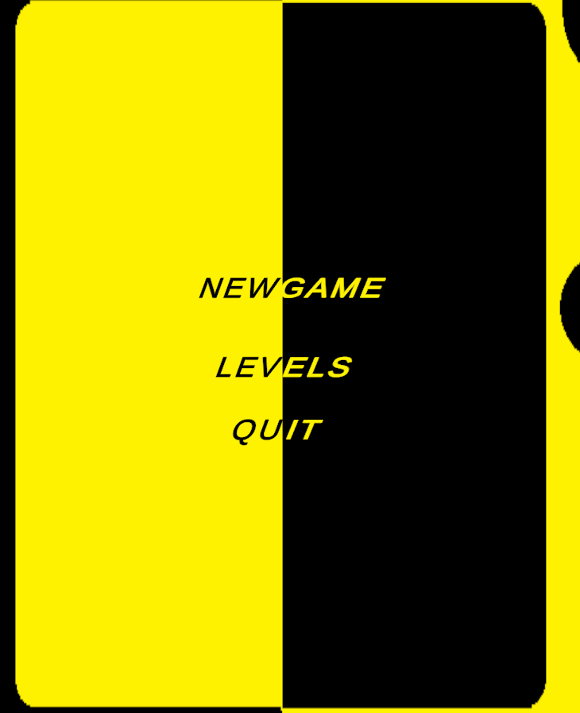
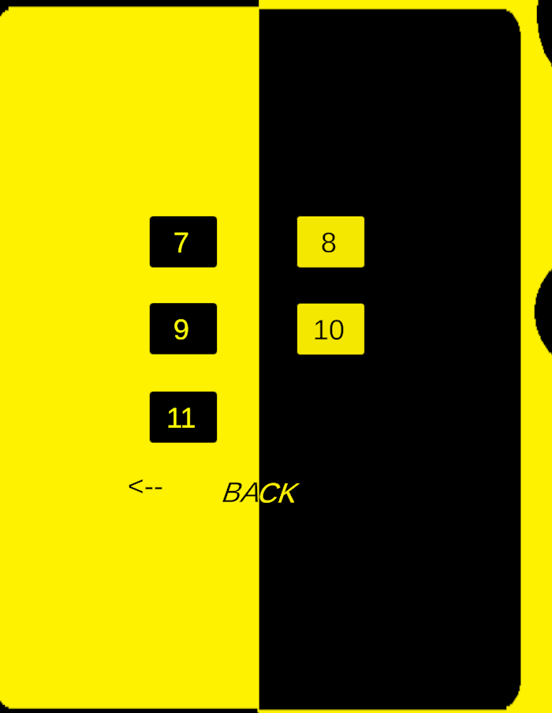
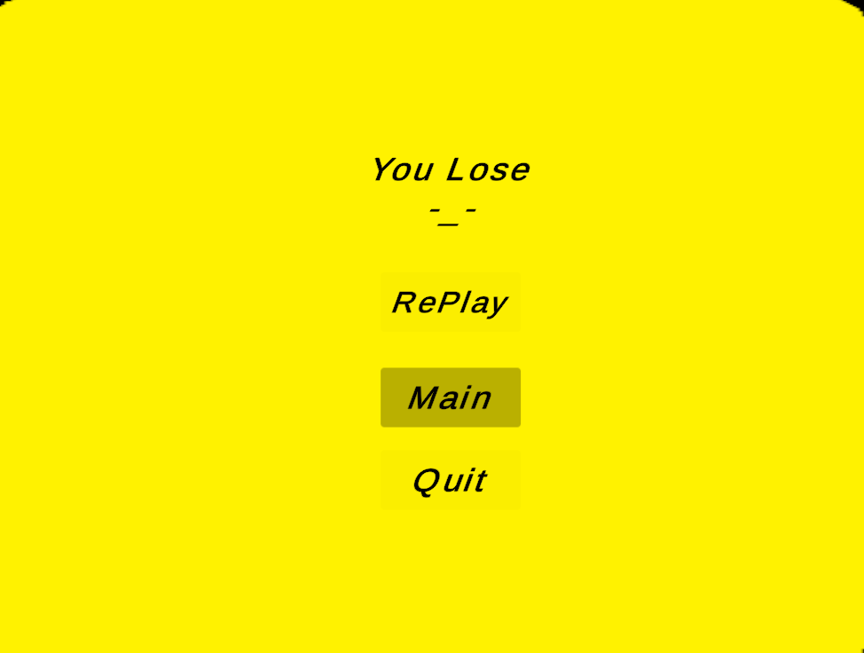
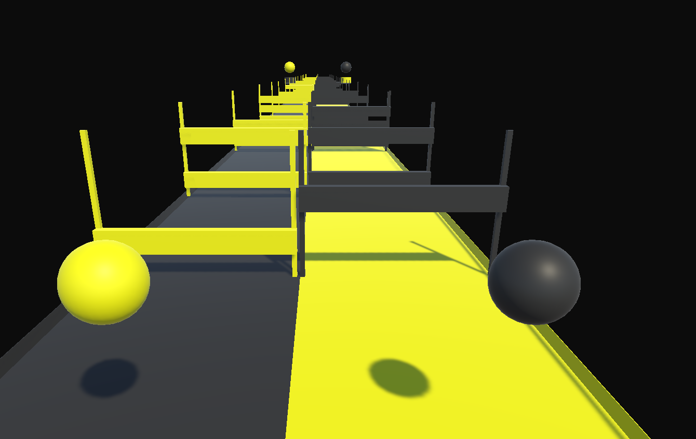
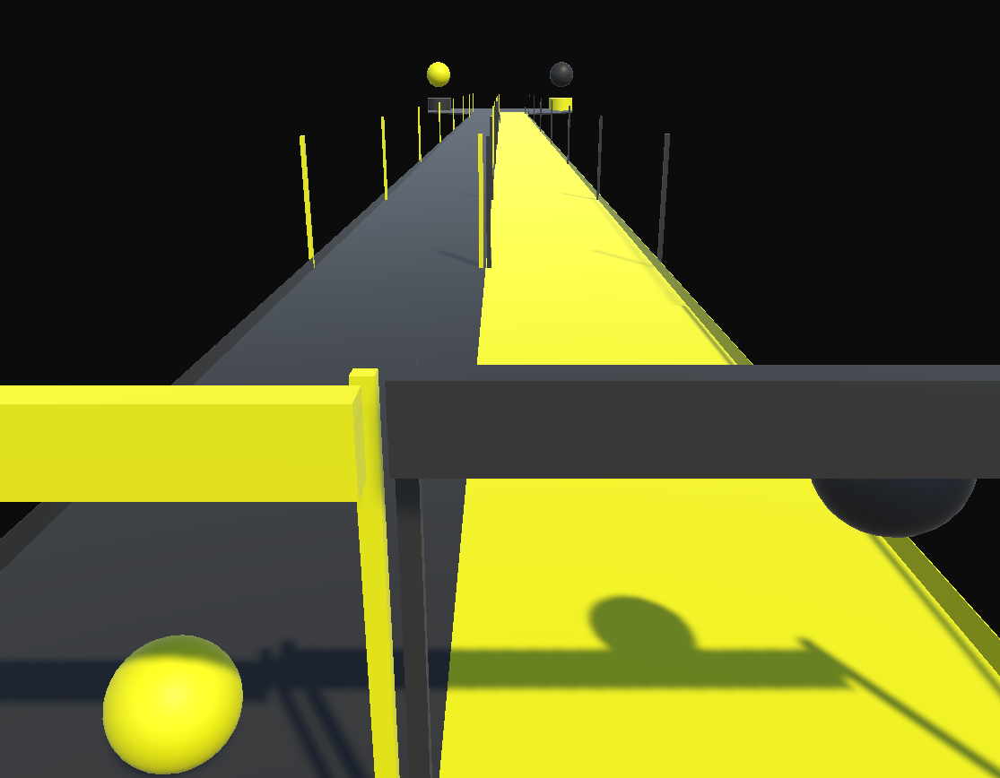
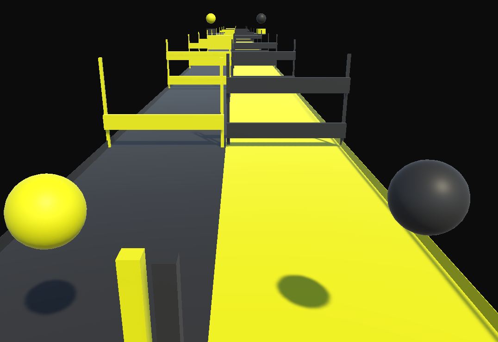

# Dual-Sphere Physics Platformer | Unity 3D Coordination Engine

  
  
  
  
  
  

A custom-built, physics-based 3D platformer developed in the Unity Engine. This project challenges player neuroplasticity and hand-eye coordination by requiring simultaneous, independent control of two distinct physical spheres across 11 progressively difficult levels. 

## 🧠 System Architecture & C# Implementation

### 1. Asynchronous Rigidbody Mechanics (`finshballscene.cs`)
To ensure crisp, responsive platforming, the game bypasses basic Unity collision events in favor of precision mathematical grounding.
* **Raycast Ground Detection:** Instead of relying on Unity's default `OnCollisionEnter` (which can accidentally trigger on walls and cause infinite wall-jumping), the code utilizes `Physics.Raycast(transform.position, Vector3.down)`. 
    * *Technical Breakdown:* A Raycast shoots an invisible laser directly downward from the exact center of the ball. We multiply the ball's height by `0.5f` (the radius) and add a tiny `0.2f` buffer. If the laser hits a collider assigned to the `maskgraound` LayerMask, the game registers the ball as strictly "grounded." This prevents the physics engine from wasting resources checking collisions against non-jumpable surfaces.
* **Velocity Override:** When a jump is triggered via the 'A' or 'D' keys, the system directly manipulates the Rigidbody's velocity vector, ensuring consistent jump heights regardless of the ball's current momentum.

### 2. Lock-Step Camera Tracking (`camramove.cs`)
Standard Unity camera parenting causes the camera to spin wildly when attached to a rolling physics sphere. This project implements a custom Late-Update tracking script to solve this.
* **Axis Isolation:** The camera strictly follows the player's `X` and `Z` coordinates but actively strips out the player's rotational data. 
* **Fixed Offset:** By storing a public `Vector3 movecam` offset, the camera maintains a perfect isometric/trailing perspective, keeping both spheres in frame regardless of how fast they are rolling or bouncing.

### 3. Stereophonic Audio Feedback (The "Two-Voice" System)
To reinforce the left-hand/right-hand brain split, the game utilizes a spatial audio system to give each sphere its own distinct "voice" or acoustic signature.
* **Stereo Panning (`AudioSource.panStereo`):** The left sphere's audio source is hard-panned to the left audio channel (-1), and the right sphere is panned to the right (1). This provides subconscious, directional acoustic feedback to the player.
* **Pitch Shifting:** By slightly offsetting the `AudioSource.pitch` of the jump and impact sound effects, the player can immediately identify which sphere triggered the physics event without needing to look directly at it, reducing cognitive overload.

### 4. Level Progression State Machine
The game scales through 11 distinct levels. The architecture supports rapid scene loading, maintaining the persistent physics logic while iterating on environmental complexity, obstacle timing, and required jump precision.

---

## 🎮 Controls & Gameplay

The core gameplay loop requires the player to mentally separate their left and right hands to navigate split-path obstacles.

| Input | Action | Mechanic |
| :--- | :--- | :--- |
| **A Key** | Jump Left Sphere | Applies upward force to Sphere 1. |
| **D Key** | Jump Right Sphere | Applies upward force to Sphere 2. |
| **Mouse/Arrows** | Directional Roll | Applies torque/velocity to navigate the track. |

## 🚀 Installation & Deployment

To play the compiled build or explore the source code:

1. Clone this repository to your local machine.
2. Open the project folder using **Unity Hub** (Ensure you have a compatible Unity Editor version installed).
3. Open the `Scenes` folder and load the `Menu.unity` scene to access the main title screen and level selector.
4. Press **Play** in the editor to navigate the UI and launch into the game organically!
